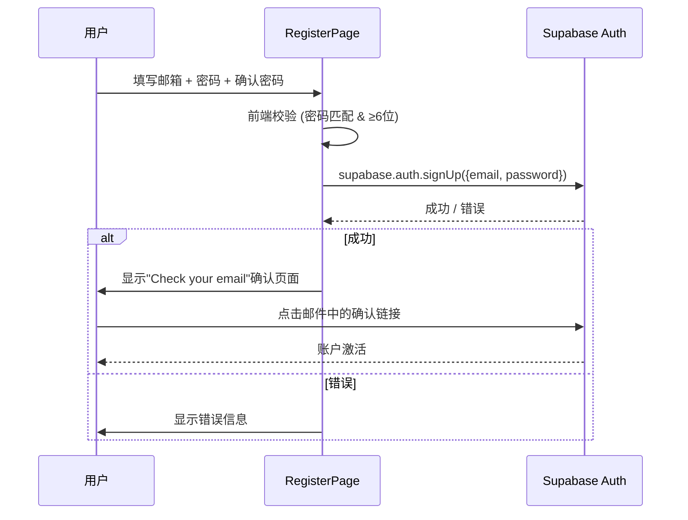
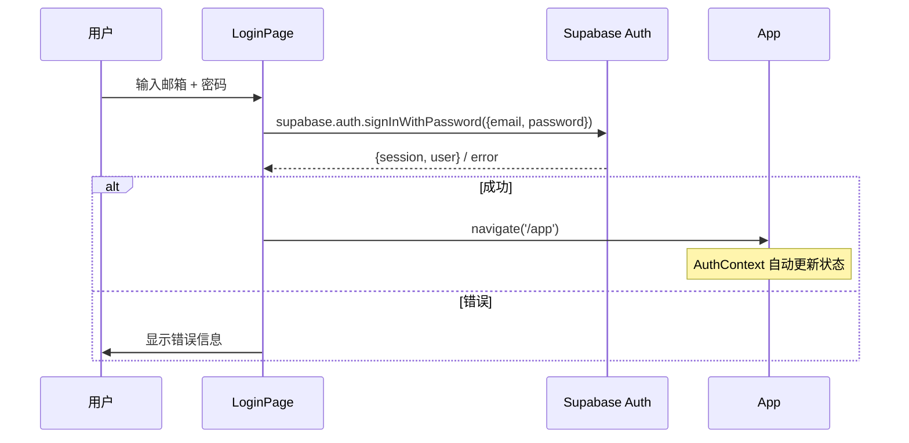
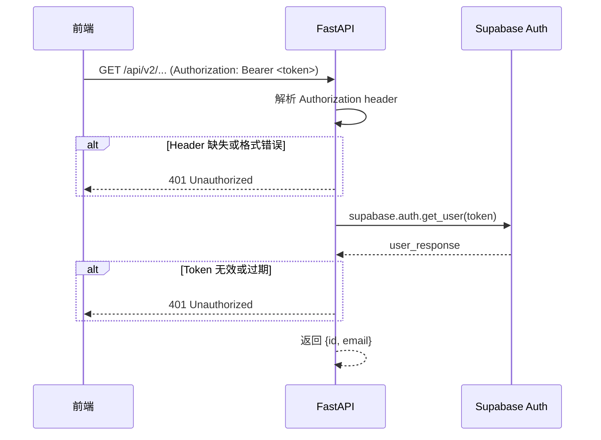
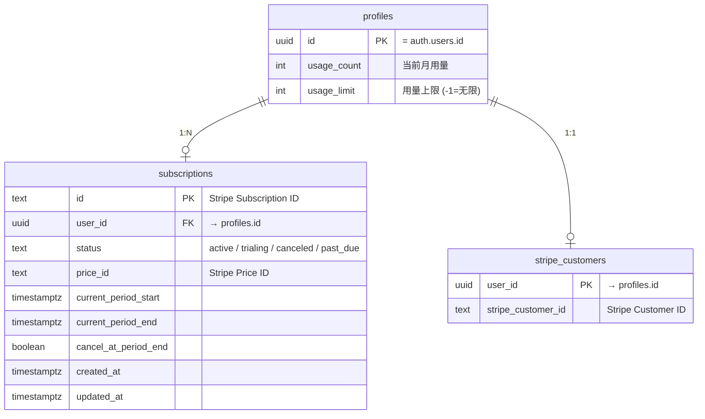
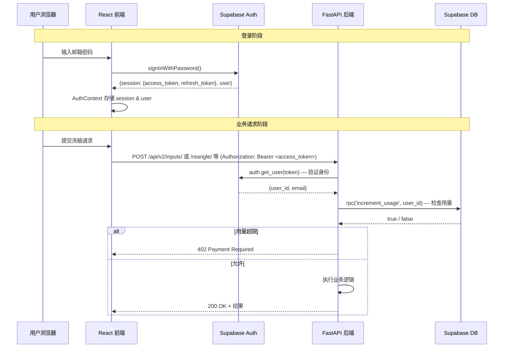

# ReAngle 用户系统技术文档

本文档说明基于 Supabase 的身份认证、用户与用量表设计、Stripe 订阅与 Webhook 同步及前后端实现要点，面向需要理解或扩展登录与计费逻辑的开发者。

> 基于 Supabase 的身份认证、用量管理与订阅计费系统

---

## 1. 系统架构概览

```mermaid
graph TB
    subgraph Frontend["前端 (React + Vite)"]
        SC["supabase.ts<br/>Supabase Client"]
        AC["AuthContext.tsx<br/>认证上下文"]
        PR["ProtectedRoute.tsx<br/>路由守卫"]
        LP["LoginPage.tsx"]
        RP["RegisterPage.tsx"]
        PP["ProfilePage.tsx"]
        PG["PricingPage.tsx"]
    end

    subgraph Backend["后端 (FastAPI)"]
        DEP["dependencies.py<br/>get_current_user<br/>check_usage_limit"]
        SS["stripe_service.py<br/>订阅同步"]
        PAY["payment.py<br/>支付路由"]
        IN["inputs/reangle<br/>等 v2 业务路由"]
    end

    subgraph Supabase["Supabase"]
        AUTH["Auth Service<br/>JWT 签发/验证"]
        DB["PostgreSQL<br/>profiles / subscriptions<br/>stripe_customers"]
        RPC["RPC: increment_usage"]
    end

    subgraph Stripe["Stripe"]
        CHK["Checkout Session"]
        WH["Webhook Events"]
        PL["Customer Portal"]
    end

    SC --> AUTH
    AC --> SC
    PR --> AC
    LP --> AC
    RP --> AC
    PP -->|Bearer Token| PAY
    PG -->|Bearer Token| PAY

    DEP -->|auth.get_user(token)| AUTH
    DEP -->|rpc('increment_usage')| RPC
    SS -->|table CRUD| DB
    PAY --> DEP
    PAY --> SS
    IN --> DEP

    WH --> PAY
    SS --> CHK
    SS --> PL
```

### 技术栈

| 层级              | 技术                                 | 版本    |
| ----------------- | ------------------------------------ | ------- |
| 前端框架          | React + Vite + TypeScript            | —       |
| 前端 Auth SDK     | `@supabase/supabase-js`              | ^2.97.0 |
| 后端框架          | FastAPI (Python)                     | —       |
| 后端 Supabase SDK | `supabase` (Python)                  | 2.28.0  |
| BaaS              | Supabase (Auth + PostgreSQL)         | —       |
| 支付              | Stripe (Checkout + Portal + Webhook) | —       |

---

## 2. 环境变量配置

### 前端 (`.env` 中以 `VITE_` 前缀)

| 变量                            | 说明                             |
| ------------------------------- | -------------------------------- |
| `VITE_SUPABASE_URL`             | Supabase 项目 URL                |
| `VITE_SUPABASE_PUBLISHABLE_KEY` | Supabase `anon` 公钥（前端安全） |

### 后端 (`.env`)

| 变量                       | 说明                                         |
| -------------------------- | -------------------------------------------- |
| `SUPABASE_URL`             | Supabase 项目 URL                            |
| `SUPABASE_PUBLISHABLE_KEY` | Supabase `anon` 公钥                         |
| `SUPABASE_SECRET_KEY`      | Supabase `service_role` 密钥（后端管理操作） |
| `STRIPE_SECRET_KEY`        | Stripe 密钥                                  |
| `STRIPE_WEBHOOK_SECRET`    | Stripe Webhook 签名密钥                      |
| `PRICE_ID_PRO`             | Pro 计划的 Stripe Price ID                   |
| `FRONTEND_URL`             | 前端部署地址（用于回调跳转）                 |

> **安全提示**: `SUPABASE_SECRET_KEY` 和 `STRIPE_SECRET_KEY` 仅在后端使用，绝不暴露给前端。

---

## 3. 前端认证实现

### 3.1 Supabase Client 初始化

**文件**: `frontend/src/lib/supabase.ts`

```typescript
import { createClient } from "@supabase/supabase-js";

const supabaseUrl = import.meta.env.VITE_SUPABASE_URL;
const supabaseAnonKey = import.meta.env.VITE_SUPABASE_PUBLISHABLE_KEY;

// 启动时校验环境变量
if (!supabaseUrl || !supabaseAnonKey) {
  throw new Error("Missing Supabase environment variables.");
}

export const supabase = createClient(supabaseUrl, supabaseAnonKey);
```

### 3.2 AuthContext 认证上下文

**文件**: `frontend/src/context/AuthContext.tsx`

提供全局认证状态和操作方法：

| 状态/方法 | 类型                           | 说明                          |
| --------- | ------------------------------ | ----------------------------- |
| `user`    | `User \| null`                 | 当前登录用户对象              |
| `session` | `Session \| null`              | 当前会话（含 `access_token`） |
| `loading` | `boolean`                      | 初始化加载状态                |
| `signUp`  | `(email, password) => Promise` | 邮箱注册                      |
| `signIn`  | `(email, password) => Promise` | 邮箱密码登录                  |
| `signOut` | `() => Promise`                | 登出                          |

**核心机制**:

1. **初始化**: 组件挂载时调用 `supabase.auth.getSession()` 获取已有会话
2. **状态监听**: 通过 `supabase.auth.onAuthStateChange()` 实时监听登录/登出/Token 刷新事件
3. **清理**: 组件卸载时取消订阅 (`subscription.unsubscribe()`)

### 3.3 路由守卫

**文件**: `frontend/src/components/ProtectedRoute.tsx`

```text
加载中 → 显示 Loading...
未登录 → Navigate to /login
已登录 → 渲染子组件
```

### 3.4 路由结构

**文件**: `frontend/src/App.tsx`

| 路径        | 组件         | 访问权限  |
| ----------- | ------------ | --------- |
| `/`         | LandingPage  | 公开      |
| `/login`    | LoginPage    | 公开      |
| `/register` | RegisterPage | 公开      |
| `/pricing`  | PricingPage  | 公开      |
| `/app`      | MainApp      | 🔒 需登录 |
| `/profile`  | ProfilePage  | 🔒 需登录 |

### 3.5 注册流程



### 3.6 登录流程



---

## 4. 后端认证实现

### 4.1 配置管理

**文件**: `app/configs/supabase_config.py`

从 `.env` 读取配置，并定义业务常量:

```python
FREE_TIER_LIMIT = 5    # 免费用户每月 5 次
PRO_TIER_LIMIT = -1    # Pro 用户无限次 (-1 表示无限)
```

### 4.2 JWT 验证 — `get_current_user`

**文件**: `app/core/dependencies.py`

作为 FastAPI 依赖注入使用，验证流程:



**关键设计**: 不直接解码 JWT，而是调用 `supabase.auth.get_user(token)` 让 Supabase 服务端验证，确保 Token 未被撤销。

### 4.3 用量控制 — `check_usage_limit`

**文件**: `app/core/dependencies.py`

在需要消耗配额的路由（如 `/api/v2/inputs/`）中使用：

```python
@inputs_router.post("/", ...)
async def process_inputs(
    ...,
    user: dict = Depends(check_usage_limit),  # 先验证身份，再检查用量
):
```

**原子操作流程**:

1. 调用 `get_current_user` 获取用户身份
2. 调用 Supabase RPC 函数 `increment_usage(row_id)`
3. 若返回 `false` → 抛出 **402 Payment Required**
4. 若返回 `true` → 放行请求

---

## 5. 数据库设计

### 5.1 Supabase 表结构



### 5.2 RPC 函数

**`increment_usage(row_id uuid)`**

- 原子递增 `profiles.usage_count`
- 判断是否超过 `usage_limit`（`-1` 表示无限制）
- 返回 `true`（允许）或 `false`（超限）

---

## 6. Stripe 订阅集成

### 6.1 State-Based Sync 模式

系统采用 **State-Based Sync** 模式同步订阅状态:

> Webhook 仅作为"有变化"的**通知信号**，收到后始终从 Stripe API 拉取最新权威数据写入数据库。

### 6.2 支付 API 端点

| 方法 | 路径                                      | 认证               | 说明                          |
| ---- | ----------------------------------------- | ------------------ | ----------------------------- |
| POST | `/api/v2/payment/create-checkout-session` | ✅                 | 创建 Checkout 或重定向 Portal |
| POST | `/api/v2/payment/create-portal-session`   | ✅                 | 创建 Stripe 管理门户          |
| POST | `/api/v2/payment/webhook`                 | ❌ Stripe 签名验证 | Webhook 端点                  |
| GET  | `/api/v2/payment/usage`                   | ✅                 | 获取用量与订阅信息            |

### 6.3 Webhook 处理事件

| 事件                                            | 处理逻辑                                |
| ----------------------------------------------- | --------------------------------------- |
| `checkout.session.completed`                    | 关联 User ↔ Customer，同步 Subscription |
| `customer.subscription.created/updated/deleted` | State-Based Sync 同步订阅状态           |
| `invoice.payment_succeeded`                     | 续费时重置 `usage_count = 0`            |
| `invoice.payment_failed`                        | 同步订阅状态（变为 `past_due`）         |

### 6.4 防重复订阅

创建 Checkout Session 前，检查用户是否已有 `active` 或 `trialing` 订阅:

- **有**: 跳转至 Customer Portal（管理已有订阅）
- **无**: 创建新的 Checkout Session

---

## 7. 请求认证流程（完整）



---

## 8. 安全设计要点

| 要点             | 实现方式                                                    |
| ---------------- | ----------------------------------------------------------- |
| **密钥隔离**     | 前端仅使用 `anon` 公钥；`service_role` 密钥仅在后端使用     |
| **Token 验证**   | 通过 Supabase `auth.get_user()` 服务端验证，非本地 JWT 解码 |
| **用量原子操作** | 数据库 RPC 函数 `increment_usage` 确保并发安全              |
| **Webhook 签名** | 使用 `stripe.Webhook.construct_event()` 验证签名            |
| **CORS**         | 仅允许 `FRONTEND_URL` 来源的跨域请求                        |
| **密码策略**     | 前端强制 ≥ 6 位，Supabase 侧可配置更多规则                  |
| **邮箱验证**     | 注册后需点击确认邮件激活账户                                |

---

## 9. 文件索引

### 前端

| 文件                                         | 职责                                |
| -------------------------------------------- | ----------------------------------- |
| `frontend/src/lib/supabase.ts`               | Supabase Client 初始化              |
| `frontend/src/context/AuthContext.tsx`       | 全局认证状态管理（Provider + Hook） |
| `frontend/src/components/ProtectedRoute.tsx` | 路由守卫组件                        |
| `frontend/src/pages/LoginPage.tsx`           | 登录页面                            |
| `frontend/src/pages/RegisterPage.tsx`        | 注册页面（含邮箱确认引导）          |
| `frontend/src/pages/ProfilePage.tsx`         | 用户中心（用量 + 订阅管理）         |
| `frontend/src/pages/PricingPage.tsx`         | 定价页面（Checkout 跳转）           |
| `frontend/src/App.tsx`                       | 路由定义 + AuthProvider 包裹        |

### 后端

| 文件                             | 职责                                              |
| -------------------------------- | ------------------------------------------------- |
| `app/configs/supabase_config.py` | Supabase / Stripe 环境变量 + 业务常量             |
| `app/core/dependencies.py`       | `get_current_user` + `check_usage_limit` 依赖注入 |
| `app/services/stripe_service.py` | Stripe 客户/订阅/Webhook 处理 + State-Based Sync  |
| `app/routers/v2/payment.py`      | 支付相关 API 路由 + Webhook 端点                  |
| `app/routers/v2/inputs.py`      | 多源输入处理（使用 `check_usage_limit` 鉴权）     |
| `app/routers/v2/reangle.py`      | ReAngle 改写路由（依赖 Session 与用户设置）       |
