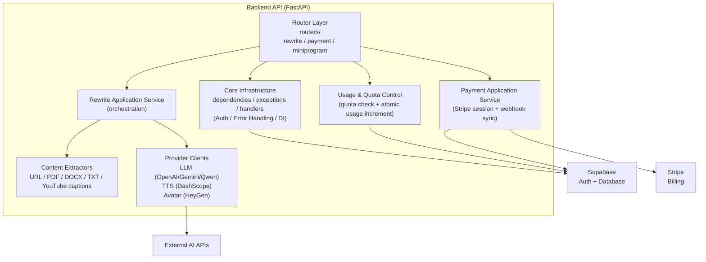

# Component Diagram

```mermaid
flowchart TB
  %% C4 L3 - Backend Components (FastAPI)
  subgraph API["Backend API (FastAPI)"]
    RL["Router Layer<br/>routers/<br/>rewrite / payment / miniprogram"]
    CORE["Core Infrastructure<br/>dependencies / exceptions / handlers<br/>(Auth / Error Handling / DI)"]
    USAGE["Usage & Quota Control<br/>(quota check + atomic usage increment)"]
    REWRITE["Rewrite Application Service<br/>(orchestration)"]
    EXTRACT["Content Extractors<br/>URL / PDF / DOCX / TXT / YouTube captions"]
    PAY["Payment Application Service<br/>(Stripe session + webhook sync)"]
    PROVIDERS["Provider Clients<br/>LLM (OpenAI/Gemini/Qwen)<br/>TTS (DashScope)<br/>Avatar (HeyGen)"]
  end

  SB["Supabase<br/>Auth + Database"]
  ST["Stripe<br/>Billing"]
  AI["External AI APIs"]

  RL --> CORE
  RL --> USAGE
  RL --> REWRITE
  RL --> PAY

  CORE --> SB
  USAGE --> SB

  REWRITE --> EXTRACT
  REWRITE --> PROVIDERS
  PAY --> ST
  PAY --> SB

  PROVIDERS --> AI
```
