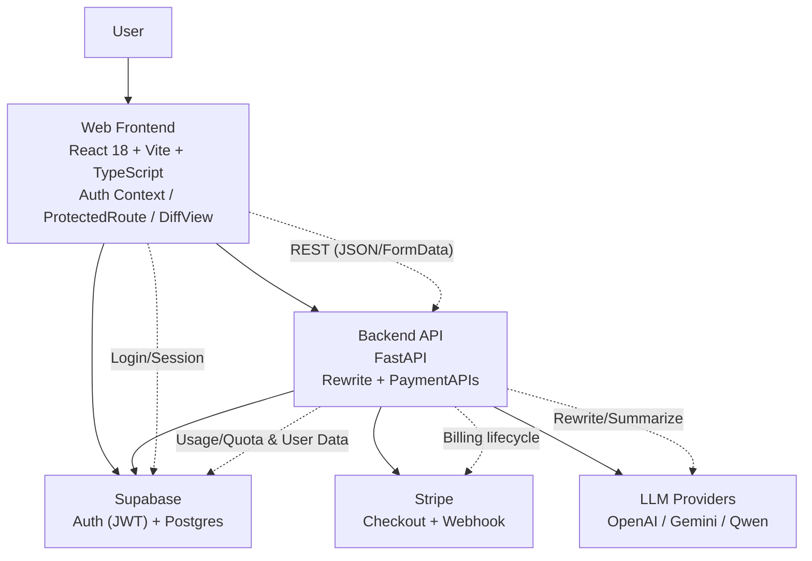

# Container Diagram

```mermaid
flowchart TB
  U[User] --> FE["Web Frontend<br/>React 18 + Vite + TypeScript<br/>Auth Context / ProtectedRoute / DiffView"]
  FE --> API["Backend API<br/>FastAPI<br/>Rewrite + PaymentAPIs"]

  FE --> SB["Supabase<br/>Auth (JWT) + Postgres"]
  API --> SB
  API --> ST["Stripe<br/>Checkout + Webhook"]
  API --> LLM["LLM Providers<br/>OpenAI / Gemini / Qwen"]

  FE -. "REST (JSON/FormData)" .-> API
  FE -. "Login/Session" .-> SB
  API -. "Usage/Quota & User Data" .-> SB
  API -. "Billing lifecycle" .-> ST
  API -. "Rewrite/Summarize" .-> LLM
```
