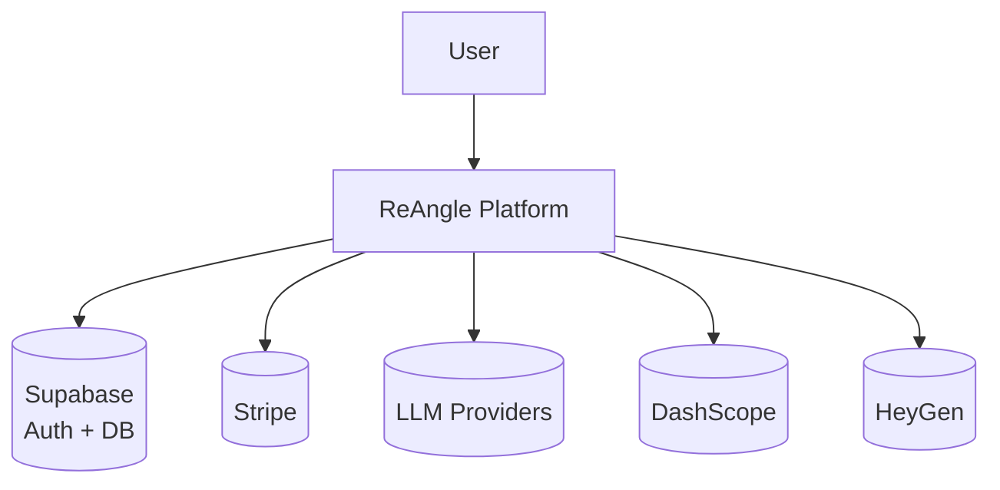

# System Context Diagram

```mermaid
flowchart TB
    User[User]
    ReAngle[ReAngle Platform]

    Supabase[(Supabase\nAuth + DB)]
    Stripe[(Stripe)]
    LLM[(LLM Providers)]
    TTS[(DashScope)]
    Avatar[(HeyGen)]

    User --> ReAngle
    ReAngle --> Supabase
    ReAngle --> Stripe
    ReAngle --> LLM
    ReAngle --> TTS
    ReAngle --> Avatar
```
