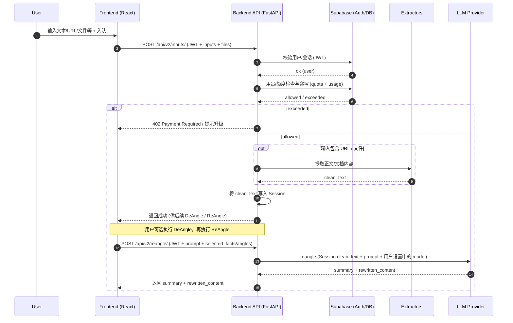

# Sequence Diagram

```mermaid
sequenceDiagram
  autonumber
  participant U as User
  participant FE as Frontend (React)
  participant API as Backend API (FastAPI)
  participant SB as Supabase (Auth/DB)
  participant EXT as Extractors
  participant LLM as LLM Provider

  U->>FE: 输入文本/URL/文件等 + 入队
  FE->>API: POST /api/v2/inputs/ (JWT + inputs + files)

  API->>SB: 校验用户/会话 (JWT)
  SB-->>API: ok (user)

  API->>SB: 用量/额度检查与递增 (quota + usage)
  SB-->>API: allowed / exceeded

  alt exceeded
    API-->>FE: 402 Payment Required / 提示升级
  else allowed
    opt 输入包含 URL / 文件
      API->>EXT: 提取正文/文档内容
      EXT-->>API: clean_text
    end
    API->>API: 将 clean_text 写入 Session
    API-->>FE: 返回成功 (供后续 DeAngle / ReAngle)

    Note over FE,API: 用户可选执行 DeAngle，再执行 ReAngle
    FE->>API: POST /api/v2/reangle/ (JWT + prompt + selected_facts/angles)
    API->>LLM: reangle (Session.clean_text + prompt + 用户设置中的 model)
    LLM-->>API: summary + rewritten_content
    API-->>FE: 返回 summary + rewritten_content
  end
```
