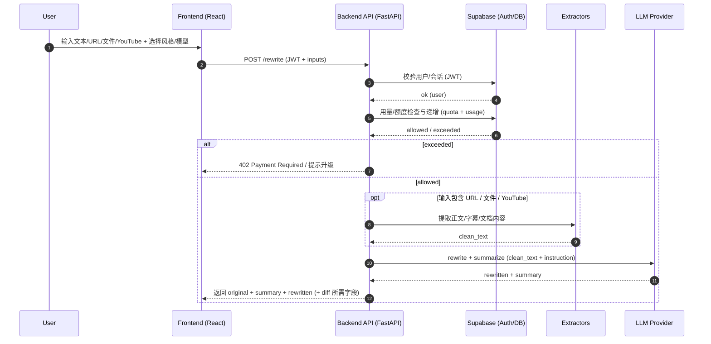

# Sequence Diagram

```mermaid
sequenceDiagram
  autonumber
  participant U as User
  participant FE as Frontend (React)
  participant API as Backend API (FastAPI)
  participant SB as Supabase (Auth/DB)
  participant EXT as Extractors
  participant LLM as LLM Provider

  U->>FE: 输入文本/URL/文件/YouTube + 选择风格/模型
  FE->>API: POST /rewrite (JWT + inputs)

  API->>SB: 校验用户/会话 (JWT)
  SB-->>API: ok (user)

  API->>SB: 用量/额度检查与递增 (quota + usage)
  SB-->>API: allowed / exceeded

  alt exceeded
    API-->>FE: 402 Payment Required / 提示升级
  else allowed
    opt 输入包含 URL / 文件 / YouTube
      API->>EXT: 提取正文/字幕/文档内容
      EXT-->>API: clean_text
    end

    API->>LLM: rewrite + summarize (clean_text + instruction)
    LLM-->>API: rewritten + summary

    API-->>FE: 返回 original + summary + rewritten (+ diff 所需字段)
  end
```
