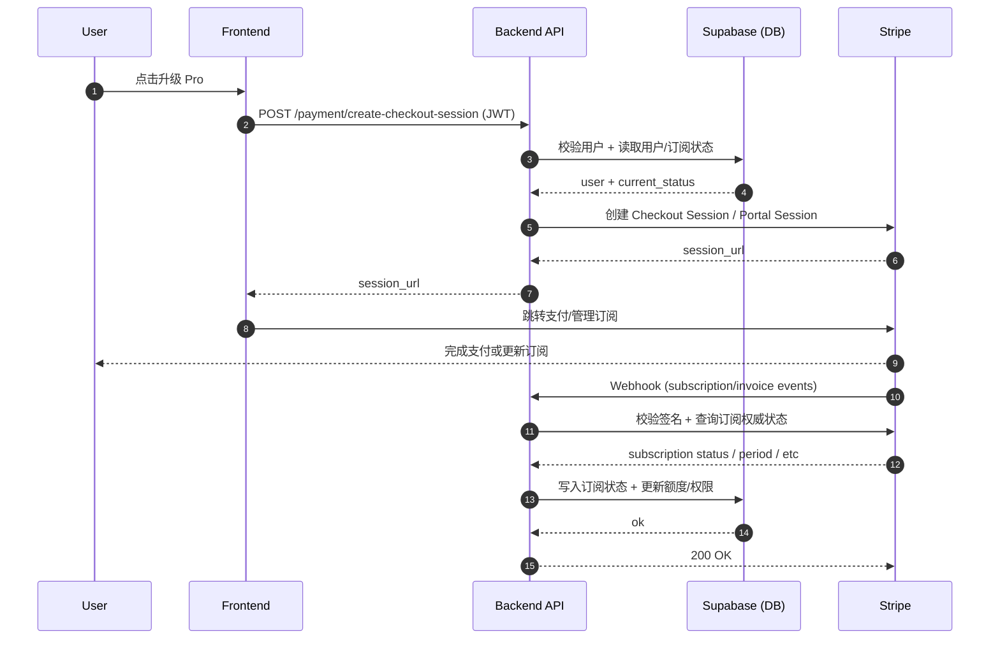

# Sequence Diagram - Stripe Subscription

```mermaid
sequenceDiagram
  autonumber
  participant U as User
  participant FE as Frontend
  participant API as Backend API
  participant SB as Supabase (DB)
  participant ST as Stripe

  U->>FE: 点击升级 Pro
  FE->>API: POST /payment/create-checkout-session (JWT)
  API->>SB: 校验用户 + 读取用户/订阅状态
  SB-->>API: user + current_status

  API->>ST: 创建 Checkout Session / Portal Session
  ST-->>API: session_url
  API-->>FE: session_url
  FE->>ST: 跳转支付/管理订阅
  ST-->>U: 完成支付或更新订阅

  ST->>API: Webhook (subscription/invoice events)
  API->>ST: 校验签名 + 查询订阅权威状态
  ST-->>API: subscription status / period / etc
  API->>SB: 写入订阅状态 + 更新额度/权限
  SB-->>API: ok
  API-->>ST: 200 OK
```
